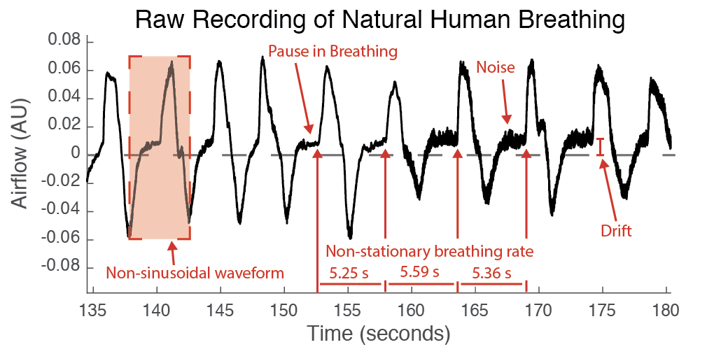
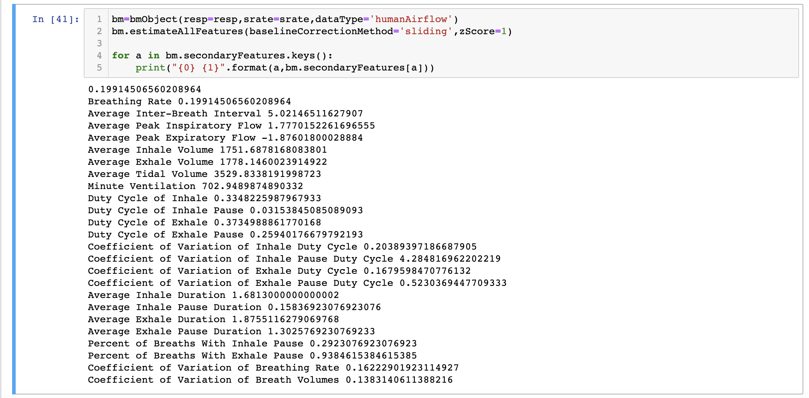
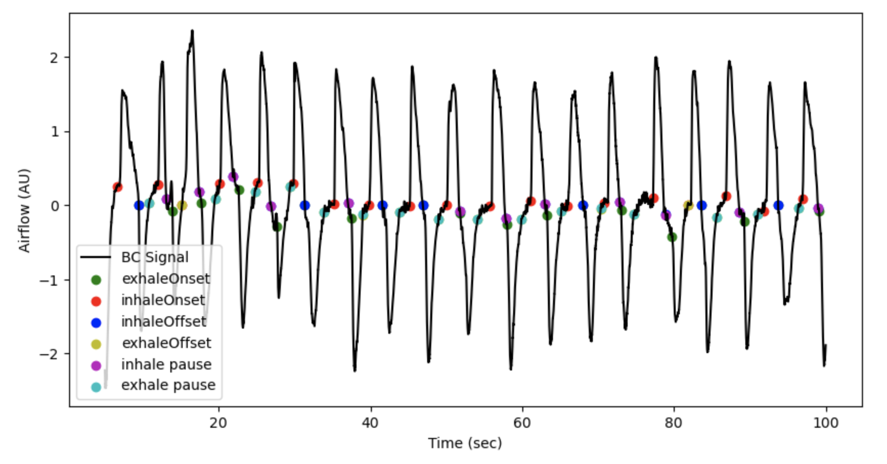

# BreathMetrics Python (in development)
### Version 0
### 8/15/2023

# This toolbox is fully functional and valadated in [Matlab](https://github.com/zelanolab/breathmetrics) but this Python translation is under active development and some of the core functions are still being added and tested.

BreathMetrics is a  toolbox for analyzing respiratory recordings.

Respiratory signals contain a wealth of information but they can be quite challenging to analyze because breathing is inhearently complex and respiratory recordings tend to be prone to noise. Breathmetrics was designed to make analyzing respiratory recordings easier by automatically de-noising the data and extracting the many features embedded within respiratory recordings. 
The methods used for automatically extracting features of respiratory recordings have been validated, peer-reviewed, and published in Chemical Senses, a scientific journal.

Breathmetrics is a class with functions that serve 3 purposes:
1. Extracting features such as times of breath onsets, volumes of individual breaths, and pauses in breathing. 
2. Calculating summary statistics of breathing such as breathing rate, minute ventilation, and tidal volume. 
3. Visualizing, editing, and annotating these features using several methods including a Graphical User Interface.

## Example Output

### Structure And Parameterization of BreathMetrics Class Object

#### Visualizing Features Calculated Using BreathMetrics

## Installation
pip install is currently in devleopment.
See demo for importing this code in its current state

## Usage and Demo

A basic demo showing this toolbox's functionality can be found [Here](https://github.com/torbenator/breathmetrics_python/blob/main/examples/demo.ipynb)

## Dependencies:
Breathmetrics only requires basic functions from numpy and scipy 

## Reference
A PDF of the peer-reviewed paper validating the methods we use here can be found in this directory (NotoBreathmetricsChemicalSenses2018.pdf).

If you would like to use this code in your project, please cite:

    Noto, T., Zhou, G., Schuele, S., Templer, J., & Zelano, C. (2018). 
    Automated analysis of breathing waveforms using BreathMetrics: 
    A respiratory signal processing toolbox. Chemical Senses, 43(8), 583–597. 
    https://doi.org/10.1093/chemse/bjy045
